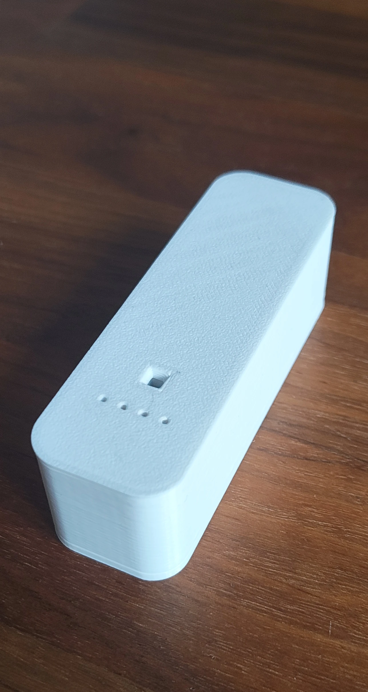
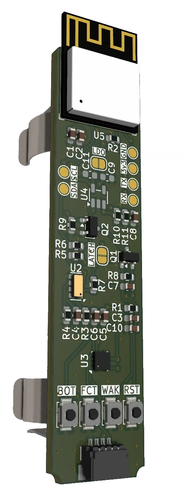
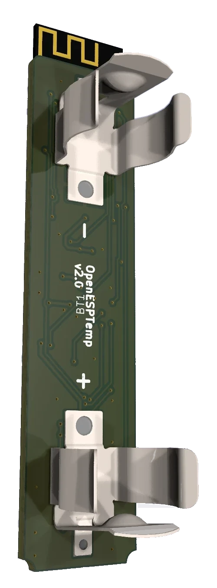
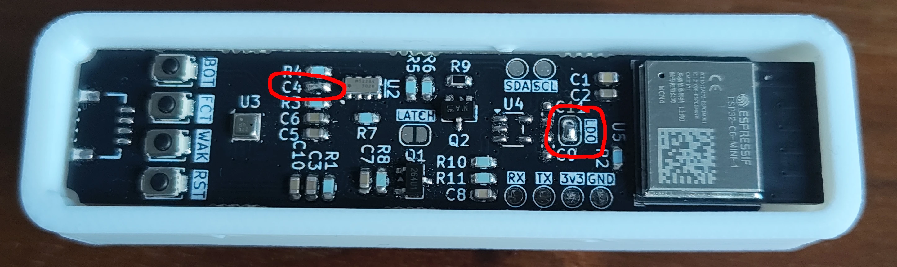
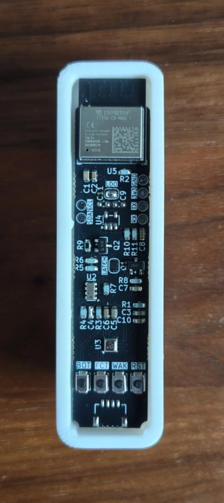
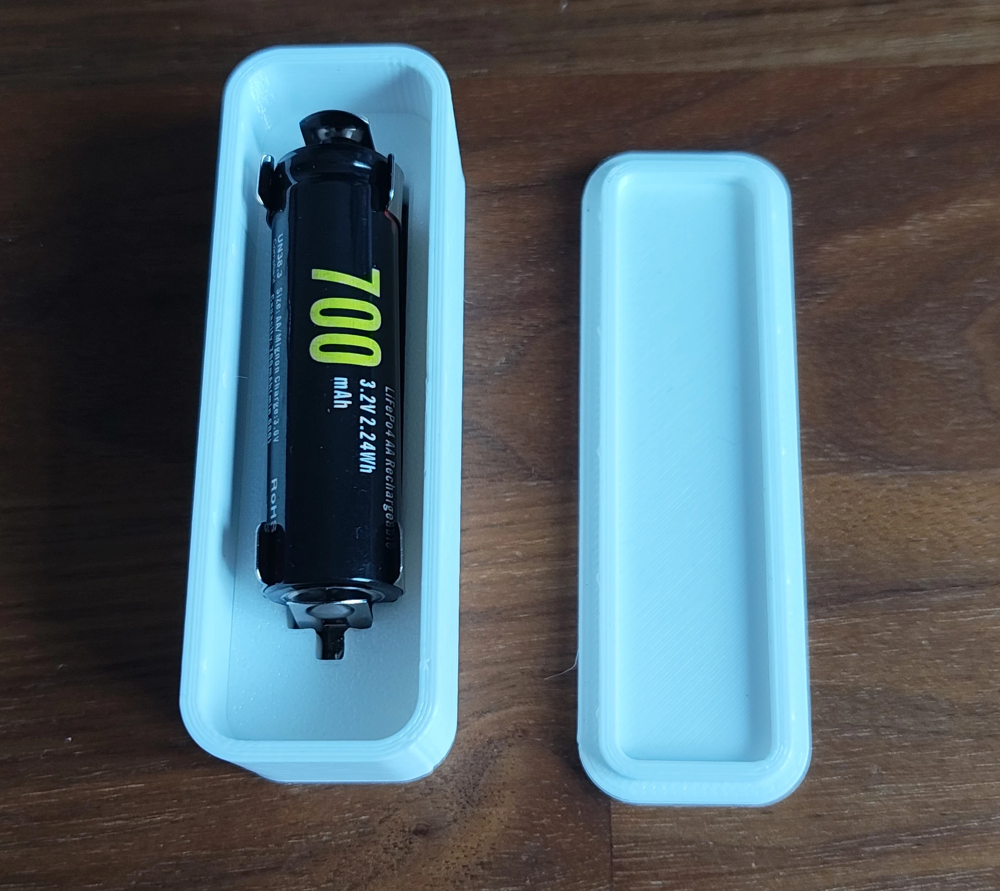
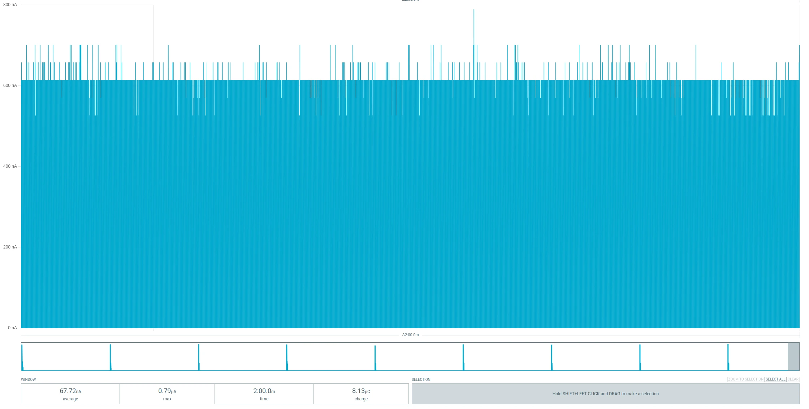
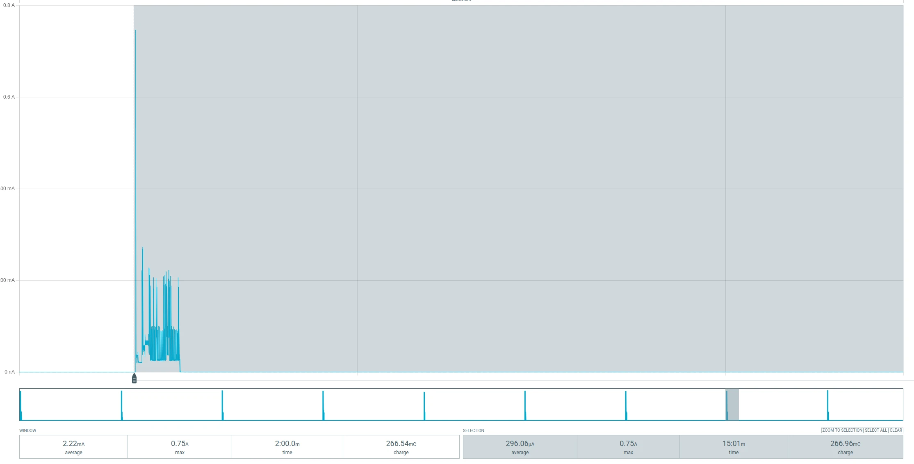
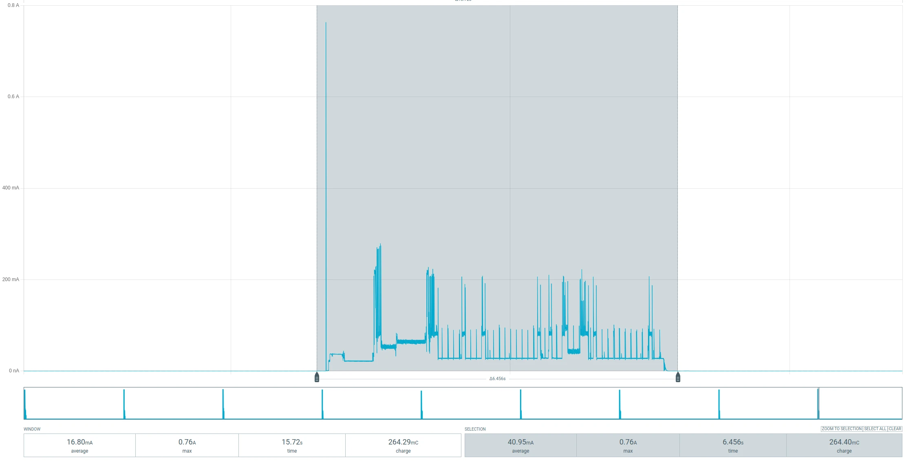
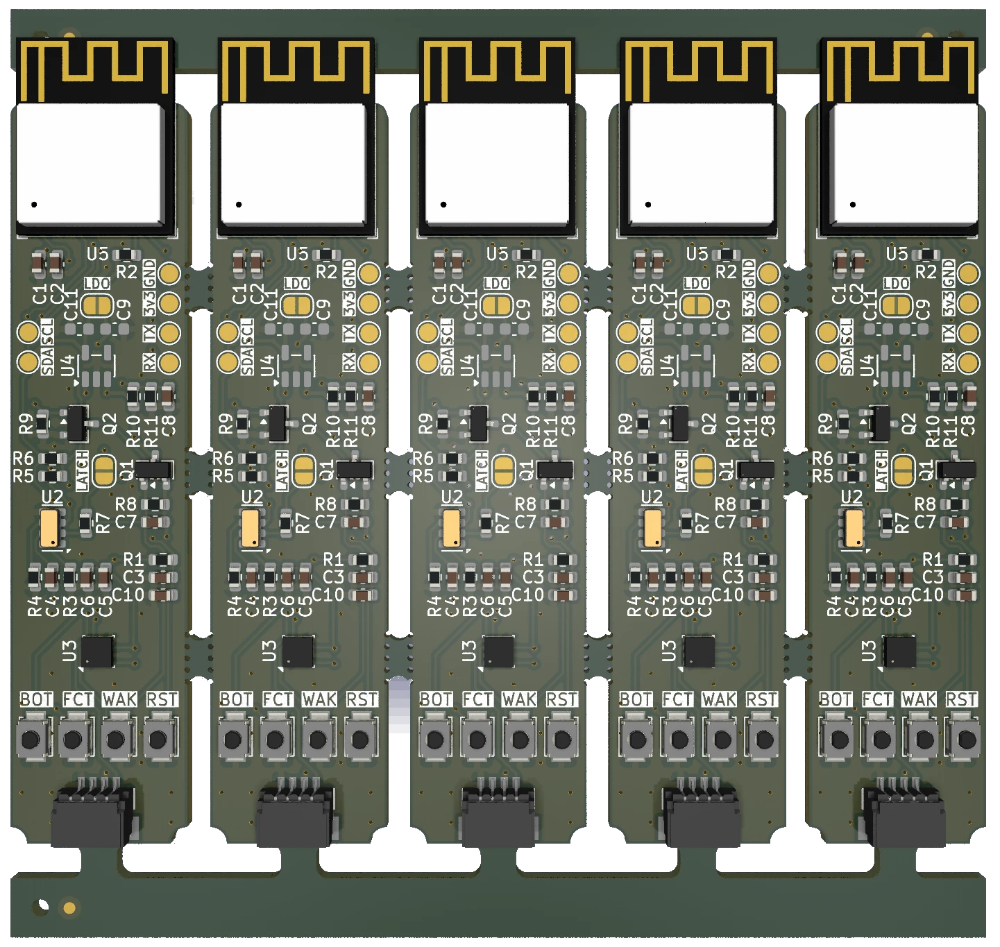

# OpenESPTemp

**OpenESPTemp** is an open-source, battery-powered temperature and environmental monitoring sensor built using an ESP32-C6 and a BME280 sensor. It is designed for integration into IoT systems.

The PCB is designed to operate with a rechargeable LiFePo4 AA battery. This repository includes the PCB design, a 3D-printable case, and basic firmware.

<div style="display: flex;">
   
   
   
</div>

---

## ✨ Features

- **Temperature Monitoring**: Provides readings using the BME280 sensor.
- **Environmental Sensing**: Includes humidity and pressure measurements.
- **Low Power**: Optimized for battery-powered operation (under 200nA power consumption while sleeping).
- **Battery Monitoring**: Allows monitoring of the battery voltage.
- **ESP32-C6 Microcontroller**: Handles wireless communication and processing.
- **Customizable PCB**: Features a Qwiic connector and the option to use an LDO when not using a LiFePo4 battery.
- **Open Source**: Fully customizable for specific use cases.
- **OTA updates**: Possibility to update the firmware over the air using ElegantOTA

---

## 🚀 Getting Started

### 1. The PCB

The PCB can be ordered from any PCB manufacturer (e.g., JLCPCB). It can be ordered as single boards or in panels of 5.

- **Manufacturing Files & BOM**: Included in the latest release. The Interactive HTML BOM (iBOM) is recommended for manual assembly.
- **SMT Assembly**: If using an SMT service, you will need to generate the BOM and position files yourself.

> **💡 Note:** You will need two Keystone 53 battery contacts; the BOM only mentions one.

### 2. Additional Parts

| Part | Quantity | Recommendation / Link | Note |
| :--- | :---: | :--- | :--- |
| **LiFePo4 AA (14500) battery (!Normal AA batteries won't work!)** | 1 | [LiFePo4 battery](https://de.aliexpress.com/item/1005005870958670.html?spm=a2g0o.store_pc_home.promoteWysiwyg_2003671164534.1005005870958670&gatewayAdapt=glo2deu) | Any 3.2V LiFePo4 battery should work |
| **3D Printing Filament (PETG)** | ~50g | [White PETG Filament](https://www.nobufil.com/product-page/filament-petg-white) | |
| **UART to USB Adapter** | 1 | [CP2102 Adapter](https://de.aliexpress.com/item/1005006742102516.html?pdp_npi=4%40dis%21EUR%21%E2%82%AC%201%2C97%21%E2%82%AC%200%2C99%21%21%212.28%211.14%21%40211b876717711633668585571ecf24%2112000038159199244%21sh%21DE%210%21X&spm=a2g0o.store_pc_allItems_or_groupList.new_all_items_2007567450475.1005006742102516&gatewayAdapt=glo2deu) | |
| **Pogo Pin Adapter** *(Optional)* | 1 | [4-Pin Prototyping Clamps](https://de.aliexpress.com/item/1005007887384238.html?pdp_npi=4%40dis%21EUR%21%E2%82%AC%2014%2C91%21%E2%82%AC%209%2C69%21%21%21119.18%2177.45%21%4021039ceb17711632823162636ed91c%2112000042738795008%21sh%21DE%216135611440%21X&spm=a2g0o.store_pc_home.allitems_choice_2009265069263.1005007887384238&gatewayAdapt=glo2deu) | Avoids soldering to test points. |

---

## 🛠️ Hardware Assembly

1. **Prepare the PCB**: Solder the components onto the PCB (if not using an SMT service).
   > **🛑 Warning:** You need to short the Solder Jumper labeled LDO when not using a LDO! (Which is the default)
   - The current version of the pcb has an issue with C4. Instead of the cap you need to short the two contacts of the capacitor.
   - Also if using a Pogo Adapter to flash the firmware, it should be flashed before mounting the battery holders, as the battery holder blocks access to the pins with the adapter.

   

2. **Print the Case**: Print using standard settings with a 0.2 mm layer height -  no supports needed.
   - The case does not require any screws, it holds together with snap connections
3. **Flash the Firmware**: Follow the instructions below to flash, and configure Wi-Fi/REST endpoint.
4. **Insert the Battery**:
   > **🛑 Warning:** Check the polarity carefully. Never connect the USB to UART adapter and the battery at the same time.
5. **Wake**: Press the WAK button for about a second. The sensor will start sending data periodically.

<div style="display: flex; gap: 20px;">
   
   
</div>

---

## 💻 Firmware

By default, the sensor connects to a specified Wi-Fi network and sends data to a REST API endpoint every 15 minutes.

The firmware also allows to update itself using Over The Air updates using [ElegantOTA](https://github.com/ayushsharma82/ElegantOTA).
Read more about that [here](#flash-using-ota-update).

> **💡 Note:** Newer [releases](https://github.com/mawaeg/OpenESPTemp/releases) include a pre-compiled `.bin` file. If you use this, you can skip the compilation step.

### Compiling (PlatformIO)

The firmware can be compiled and flashed with [PlatformIO](https://platformio.org/). You can build in debug mode (to get Serial debug information) or release mode:

```bash
# Debug mode
platformio run --environment esp32-c6-debug

# Release mode
platformio run --environment esp32-c6
```

The firmware has to be flashed via the Serial Interface once. Afterwards it can be updated with [OTA updates](#flash-using-ota-update).

### Flashing

**Wiring:** Connect the UART to USB adapter to the PCB:

| UART Adapter | Direction | PCB | Note |
| :--- | :---: | :--- | :--- |
| **3V3** | ⟷ | **3V3** | Use 3.3V only (do not use 5V) |
| **GND** | ⟷ | **GND** | Common ground is required |
| **TX** | ⟶ | **RX** | Connect Transmit to Receive |
| **RX** | ⟵ | **TX** | Connect Receive to Transmit |

> **ℹ️ Info:** Remember to **cross** the data lines! The **TX** (Transmit) pin on the adapter must connect to the **RX** (Receive) pin on the PCB, and vice versa.

> **🛑 Warning:** You must disconnect the battery before connecting the UART to USB adapter!

#### Option A: Flashing via PlatformIO
Run the following command:
```bash
platformio run --target upload --environment esp32-c6
```
When `Looking for upload port...` appears in the console, put the ESP32 into boot mode:
1. Push the Reset and Boot buttons at the same time.
2. Release the Reset button while keeping the Boot button pressed.
3. The upload will start; release the Boot button.

#### Option B: Flashing via esptool (Precompiled Binary)
Flash the binary using [esptool](https://github.com/espressif/esptool):
```bash
python -m esptool --chip esp32-c6 --port <your-port> --baud 460800 write_flash -z 0x1000 firmware.bin
```
*(Put the ESP32 into boot mode as described above, and replace `<your-port>` with the correct serial port.)*

### Flash using OTA update

The firmware allows to update itself via OTA updates. For that to work the firmware has to be flashed via UART initially.

This is how to trigger a OTA update.
1. Follow steps 1 and 2 of [Reconfigure the device](#reconfigure-the-device)
4. Open **`http://192.168.4.1/update`** in a browser.
5. Here you can upload a new binary (Either get it from the [releases page](https://github.com/mawaeg/OpenESPTemp/releases) or compile it yourself as described [here](#compiling-(platformio))).
6. When uploading while powered by battery you should press and hold the WAK button during the update

---

## ⚙️ Configuration

After flashing, press the Reset button once to start the firmware. If unconfigured, the device will create a Wi-Fi network for setup:

1. Connect to the **`OpenESPTemp Configurator`** Wi-Fi network.
2. Open **`http://192.168.4.1`** in a browser.
3. Configure the following fields in the form:
   - **SSID**: Target Wi-Fi network name.
   - **Password**: Target Wi-Fi network password.
   - **Post URL**: The URL for the POST request.
   - **Authorization**: The Bearer token for authentication (do not include "Bearer", only the token).
4. Click submit. The configuration will be saved, and the device will restart.
5. The sensor will now operate as expected.

### Reconfigure the device

To reconfigure the OpenESPTemp after it has already been configured once, you need do the following:
1. Bring the OpenESPTemp in config mode:
   1. When connected to UART: Press and hold FCT button and press RST shortly. Release FCT after ~6 seconds
   2. When running with battery: Press and hold FCT button and press WAK for around a second. Release FCT after ~6 seconds
2. The OpenESPTemp will create a network called  **`OpenESPTemp Configurator`**. Connect to it.
3. Open **`http://192.168.4.1`** in a browser an reconfigure the fields. Refer to [⚙️ Configuration](#⚙️-configuration)

---

## ⚡ Power consumption

The OpenESPTemp aims to have a very low power consumption.

During sleep, the power consumption is below 200nA (200nA is the limit of the PPK 2, it is probably at around 50nA according to the RV3028-C7 datasheet):



The power consumption for a whole cycle (15 min with sending data once) looks like this:



The power consumption for active mode (sending data) looks the following:



---

## 📐 PCB Design

The PCB was created using KiCad 9.0, the project files are located under [/electronics](/electronics).

The power latch used in this design was inspired by [this](https://circuitcellar.com/resources/quickbits/soft-latching-power-circuits/) article.

To generate a panel yourself using the provided script:
1. Install [KiKit](https://github.com/yaqwsx/KiKit).
2. Execute `/electronics/panelize.sh`.

The panel with the existing config looks like this:



---

## 🧊 CAD

The case was created using Onshape. To edit the case yourself click [here](https://cad.onshape.com/documents/398f777c8db5f4a69ffcddaa/w/b07485d077929fc2f0119cac/e/3395ca67b8682bc329248728?configuration=List_Cy8et1WFmB3Iby%3DDefault&renderMode=0&uiState=699202edfa46508150bca706) and copy the project.

The current STL files are included in the repo under [/cad](/cad).

---

## 🚧 Troubleshooting

TBD

---

## 🗺️ Coming Next

- [ ] Include mounting bracket for the case
- [ ] Include HomeAssistant integration

---

## 📄 License

This project is licensed under the GNU General Public License v3.0. See the [LICENSE](LICENSE) file for details.


### Hardware Libraries
Various libraries were used to create the PCB. Copies of most libraries are included in `/electronics/libs/` to ensure the KiCad project works without manual installation.

Some of these libraries are licensed under their respective licenses. Please review the `README.md` file in the library folders.