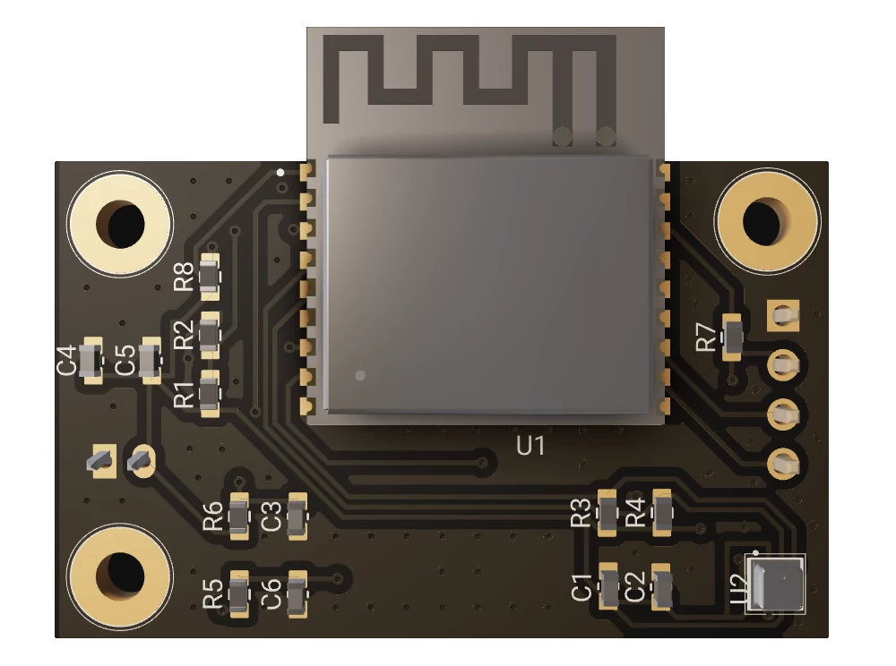
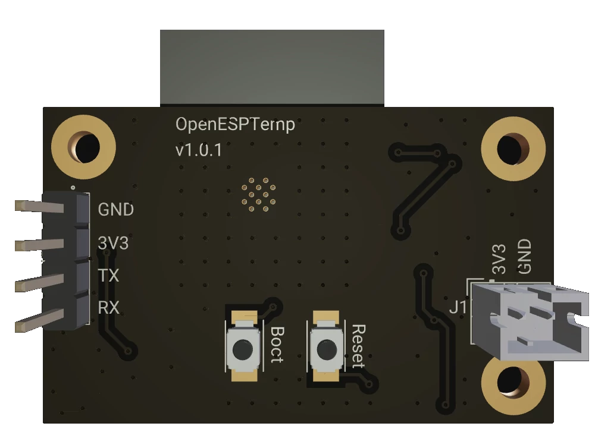
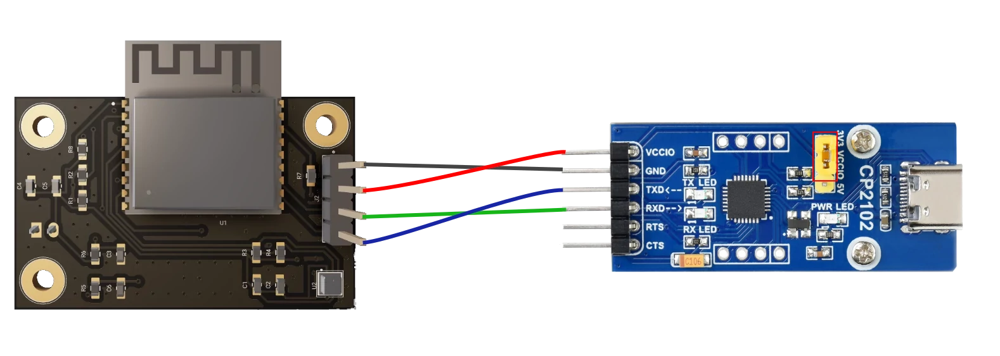

# OpenESPTemp

**OpenESPTemp** is an open-source, battery-powered temperature and environmental monitoring sensor built using ESP32-C3 and a BME280 sensor. It can easily be integrated into IoT systems.

This repository includes a pcb design, a 3d printed case and basic firmware.

<div style="display: flex;">
   
   
</div>

## Features
- **Temperature Monitoring**: Accurate readings with the BME280 sensor.
- **Environment Sensing**: Includes humidity and pressure measurements.
- **Low Power**: Optimized for battery-powered operation.
- **Battery Monitoring**: Allows to monitor the battery voltage.
- **Open Source**: Fully customizable for your specific needs.
- **ESP32-C3 Powered**: Leverages the capabilities of the ESP32-C3 for efficient wireless communication and processing.

## Getting Started

### Pcb

To get started you first need a version of the pcb using the manufacturing files included in the latest release.

I got my pcb assembled from [PCBWay](https://www.pcbway.com/).

I noticed JLCPCB has troubles assembling the pcb as the bme280 can only be assembled with their standard smt service which does not support such small pcbs.

- If you want to assemble the pcb yourself please lookup the files in the BOM from the latest release.

### Other needed parts
| Part                              | Quantity | Link (recommendation)                                                | Note
|-----------------------------------|----------|----------------------------------------------------------------------|------|
| 3D Printing Filament (PETG)       | 40g      | [PETG Filament](https://www.nobufil.com/product-page/filament-petg-white) |
| TPU Filament                      | 2g       | [TPU Filament](https://www.redline-filament.com/products/tpu-weiss?_pos=3&_sid=f40a3659a&_ss=r) |
| M2.5 Heat Inserts                 | 7        | [Heat Inserts](https://cnckitchen.store/products/gewindeeinsatz-threaded-insert-m2-5-standard-100-stk-pcs) |
| M2.5 x 12 Screws                  | 4        | [M2.5 x 12 Screws](https://cnckitchen.store/products/m2-5-screw-stainless-steel-aisi-304-low-head?variant=47945362833743) |
| M2.5 x 6 Screws                   | 3        | [M2.5 x 6 Screws](https://cnckitchen.store/products/m2-5-screw-stainless-steel-aisi-304-low-head?variant=47945362768207) |
| Keystone 204 Battery Clips        | 2        | [Battery Clips](https://www.mouser.de/ProductDetail/Keystone-Electronics/204?qs=lQmX4aIt5iBDvY1OQzCs8Q%3D%3D) |
| JST PH 2-Pin Cable (Male)         | 1        | [JST PH 2-Pin Cable](https://eckstein-shop.de/SeeedStudio2PinPowerConnector10cm2C22C0mmJST-Stecker) |
| CR123A battery                    | 1        | [CR123A](https://www.mouser.de/ProductDetail/Panasonic-Battery/CR123A?qs=n9x%252BPCefhfJMFGcu6jLWmg%3D%3D) |
| UART to USB Adapter               | 1        | [Adapter](https://eckstein-shop.de/WaveShare-CP2102-USB-UART-Board-Type-C)  |

---

### Building the OpenESPTemp
1. Get a PCB and prepare it by soldering the components onto it (if not already done through SMT assembly)
2. Print the case (and the seal) with standard print settings and a layer height of 0.2 mm
3. Insert the Heat Inserts into the holes provided using a soldering iron
4. Solder both wires of the JST Cable onto a battery clip and press them into the space into the top part of the case
5. Put the seal onto the top part of the case and the 4 small parts on the nubs where the pcb will go to protect it from scratches
6. After flashing the firmware (described in the next chapter) you can screw the pcb into place
7. Insert the battery (**Check the polarity and never connect USB to UART and battery at the same time**) and connect the battery cable to the pcb
8. The sensor should start sending data
9. You can screw the top part of the case onto the bottom part


### Building the OpenESPTemp Firmware

> **_NOTE:_** The newer releases include a .bin file which can just be flashed, as the configuration is not compiled anymore. If you want to use the precompiled binaries you can skip this.

- The firmware can be compiled and flashed with [PlatformIO](https://platformio.org/).
   - If you just want to flash the precompiled firmware you can also just use [esptool](https://github.com/espressif/esptool)
- By default the sensor connects to a given WIFI network and sends data every 15 minutes to a given api endpoint.

#### Compile
- You can build the project in debug mode to get debug information over UART or in release without debug information:
   ```shell
      platformio run --environment esp32-c3-debug
      platformio run --environment esp32-c3
   ```


### Flashing the OpenESPTemp Firmware
- First you have to connect the UART to USB Adapter to the Pcb.
   - I use a [Pogo Pin Adapter](https://www.az-delivery.de/en/products/4-pin-prototyping-clamps?_pos=2&_psq=pogo&_ss=e&_v=1.0) for that and don't solder the Pin header at all.
- The wiring should look like this:



> **_NOTE:_** When connecting the UART to USB adapter your **must disconnect the battery** beforehand!

#### Flash using PlatformIO

- To flash using PlatformIO use the following command:
   - platformio run --target upload --environment esp32-c3
- When you see `Looking for upload port...` in the console you have to put the ESP32 in boot mode:
   1. Push the Reset and the Boot button at the same time
   2. Release the Reset button while keep pressing the Boot button.
   3. The upload should now start and you can release the Boot button.

#### Flash precompiled binary using esptool
- You can flash the precompiled binary using esptool with the following command:
   ```shell
      python -m esptool --chip esp32-c3 --port <your-port> --baud 460800 write_flash -z 0x1000 firmware.bin
   ```
- You have to insert the correct port into the command, read more about it [here](https://docs.espressif.com/projects/esptool/en/latest/esp32/esptool/basic-options.html#serial-port).
- Also the ESP32 needs to be in boot mode, as described in the previous chapter

---

### Configure the OpenESPTemp
- After flashing you have to press the reset button once to start the firmware
- When the OpenESPTemp is not configured yet, it will create a WiFi network which can be used to configure the OpenESPTemp:

1. Connect to `OpenESPTemp Configurator`
2. Open `http://192.168.4.1` in your browser
   - You should now see a simple form for configuration
3. Configure the sensor:
   - SSID: SSID of the network the sensor should connect to
   - Password: Password of the network
   - Post URL: The URL where the post request should be sent to
   - Authorization: The Bearer token used for authentication (Do no include Bearer, only the token itself)
4. After clicking submit, the configuration will be saved and the OpenESPTemp will be restarted
5. Now the sensor should work as expected.

## PCB Design

The PCB for OpenESPTemp includes the following features:
- **Voltage Divider**: Allows monitoring of battery health.
- **Exposed UART Header**: Facilitates flashing and serial communication.
- **JST 2-Pin Connector**: For connecting a battery.
- **BME280 Environmental Sensor**: Measures temperature, humidity, and pressure.
- **ESP32-C3**: Powers the sensor and handles wireless communication and processing.


The PCB for OpenESPTemp was designed using [Flux](https://flux.ai). A copy of the project is included under [electronics](/electronics/), but you can also view the current version here:
[Project Link](https://www.flux.ai/cuzimsyntax/openesptemp).

Future versions of the OpenESPTemp hardware will transition to **KiCad**.


## Troubleshooting

TBD

---

## Coming next
- [ ] Move pcb to KiCad
- [ ] Include mounting bracket for the case
- [ ] Include HomeAssistant integration
- [ ] Use ESP32-C6 to add ability to use Thread / Matter / Zigbee
- [ ] Use Low Power Timer with Power Latch to further reduce power consumption

---

## License

This project is licensed under the GNU General Public License v3.0. See the [LICENSE](LICENSE) file for details.

---
